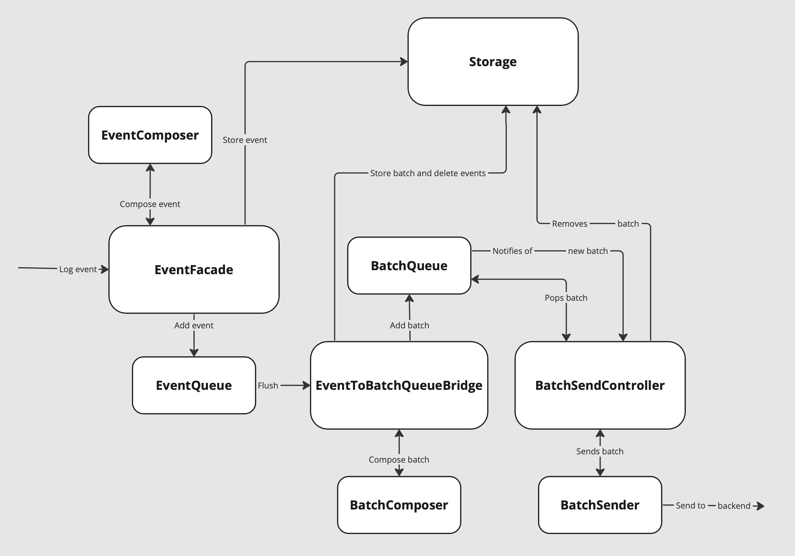

#  Developer overview
This document is intended to give you overall overview of how this SDK is built.

## Event journey

Upon receiving by SDK event goes through following steps:

1. Event's payload and header are serialized into binary form. (See `EventFacade.swift`)
2. Event is enriched with timestamp, session id, id of the current context and sequence number. (See `EventFacade.swift` and `EventComposer.swift`)
3. Event is added into `EventQueue`.
4. `EventQueue` accumulates events and flushes them once one of triggers is activated. Available triggers are: timer (flush events once a while), reaching maximum event count, context change, specific events like app being put into background.
5. `EventToBatchQueueBridge` is responsible for forming batches on `EventQueue` flush. It uses `BatchComposer` to create a batch and enrich it with additional information. Then it stores batch and puts it into `BatchQueue`.
6. When new batch is stored, all events that contained in this batch must be deleted. This 2 operations must be atomic to ensure that these same events won't appear in a new batch later.
7. `BatchQueue` holds batches and notifies `BatchSendController` when new batch is available.
8. `BatchSendController` is responsible for sending batches one by one and managing retries. It will start sending new batch when previous batch is successfully sent or if `BatchQueue` has notified it about new batch and there's no active send. Once batch is sent successfully, `BatchSendController` removes it from storage.
9. `BatchSender` is responsible for dealing with HTTP requests to Palta Brain backend. It should form a payload to send and handle the result.

## Targets structure
There's a complex targets structure. Full setup consists of 6 different targets, the main one being PaltaAnalytics. More detailed information you can find in a document 

## Context management
To exclude duplication and excessive storage usage, context is stored separately from events. Each time context is changed, snapshot of new context is assigned an UUID and saved on the disc. Also, context change triggers EventQueue flush, because there's no more point into collecting events into the same batch.
 When new event is reported, it is assigned latest known context UUID. On batch formation, it is ensured that all events in batch have the same context UUID. Then context is retrieved from disc by its id and appended to the batch. Local UUID is never sent to the server.
 Once in a while, there's a job to clean contexts from the disk that are not referenced from any event.

## Storage
Events and batches are stored in SQLite. This type of storage was choosen because it is the most lightweight storage available that supports transactions. We need transactions to guarantee that we save new batch and delete events it consists of atomically.
We store both batches and events in binary form using BLOB column type, because we don't need to access their properties in the database. Also we have a column with ids and some additional columns for batches.
Context is stored in file storage due to historical reasons. Each file represents one context snapshot.

## How we guarantee events delivery?
The most crucial task of SDK is to ensure events delivery. This SDK shows average event loss under 0.3%. There are several techniques used to achieve that.
### Retry policy
All unsuccessful batch sends are retried. The only exception is when it 401 error. In this case, we drop the batch because most probably API token was revoked.
Retry intervals grow exponentially with adding some random timeout to exclude DDoSing our own servers.

## Release process
TBD

## Miscellaneous
TBD
