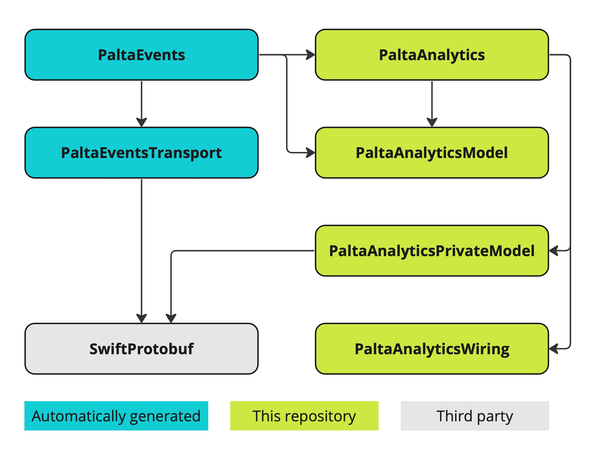

#  Targets structure

## Automatically generated
This targets are generated automatically using our Cloud Code generation service according to client's individual event schema. They are stored in a separate Github repo, one repo per client.
### PaltaEvents
This target contains all developer facing structures based on client's event schema. These structures include events, event headers, context and enums. You can know more about them in Events schema documentation.
This target depends on:
- `PaltaEventsTransport` for storing and serializing data;
- `PaltaAnalyticsModel` for conforming protocols;
- `PaltaAnalytics` to provide convenience methods like `.log()`

### PaltaEventsTransport
This target contains automatically generated Protobuf code for storing and serializing data for structures described in `PaltaEvents`. It isn't supposed to be used directly anywhere.
This target depends on:
- `SwiftProtobuf`

## Parts of this SDK
These targets are normal human-written code stored in this repository. They are separated in order to provide better separation of visibility areas and get advantage of binary loading system.

### PaltaAnalytics
This is the main SDK target and the only one supposed to be imported by client's developers. It contains an interface for reporting events as well as all business logic.
This target depends on:
- `PaltaAnalyticsModel` for defining protocols of data structures used in `PaltaEvents`;
- `PaltaAnalyticsPrivateModel` for defining protocols of data structures that are used only internally;
- `PaltaAnalyticsWiring` isn't used directly from SDK, but is included in dependencies to make it installed automatically

### PaltaAnalyticsModel
This target contains protocols describing entities that are automatically generated according to events schema. It is used to connect SDK and generated code. It has no dependencies.

### PaltaAnalyticsPrivateModel
This target contains models that are used internally in the SDK, including Protobuf code for sending batches.
This target depends on:
- `SwiftProtobuf`

### PaltaAnalyticsWiring
This is an Objective-C target. It takes advantage of ObjC's loading and reflection mechanisms. With a help of dynamic class loading, it finds a class in generated code that is responsible for connecting SDK and automatically generated code.
